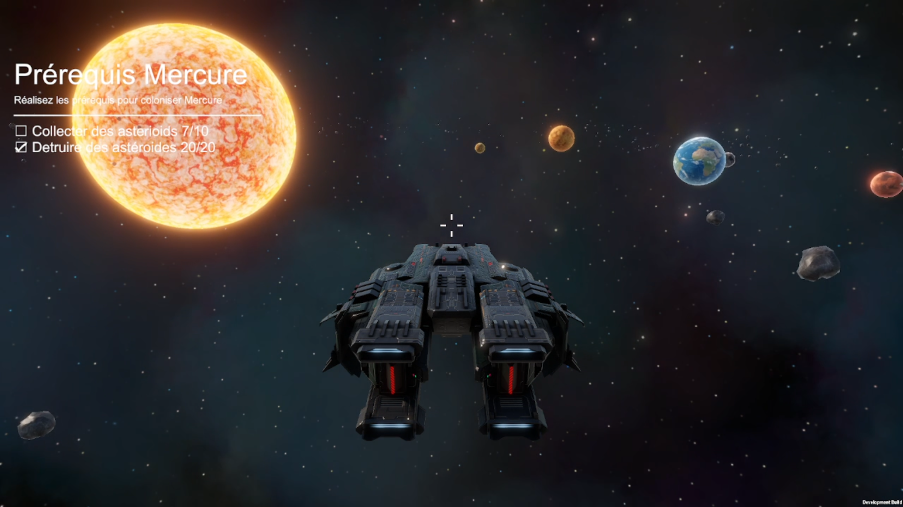
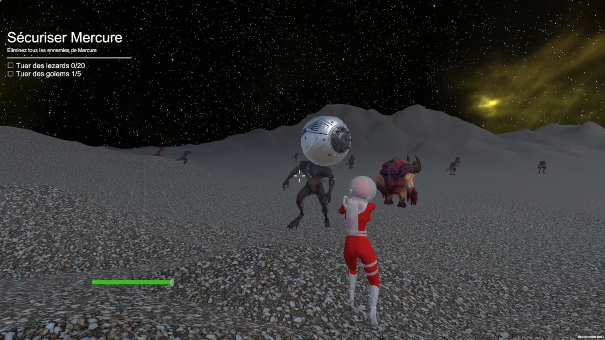
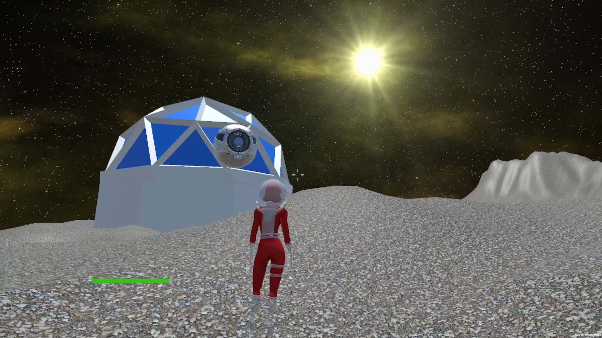
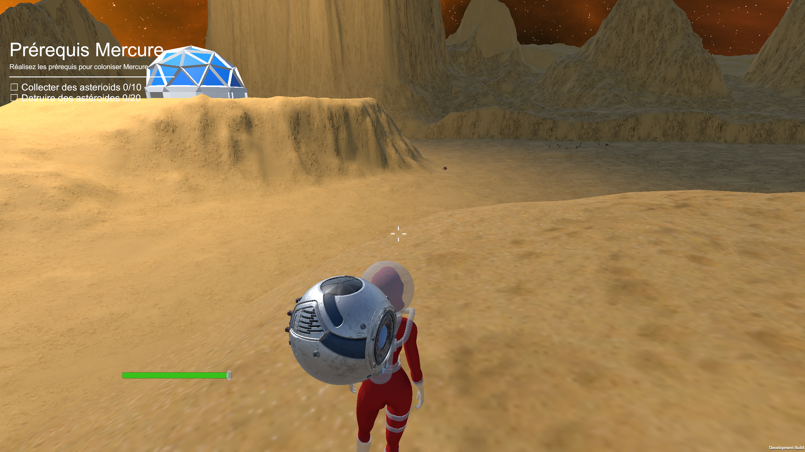

# 🚀 A Quest to Eternity — 3D Space Exploration & Action Game

**A Quest to Eternity** est un jeu d'action et d'exploration spatiale en 3D développé avec **Unity et C#** dans le cadre d'un projet académique.

Le joueur prend les commandes d'un vaisseau spatial pour explorer le système solaire, collecter des ressources, affronter des dangers et accomplir des missions de colonisation sur **Mercure et Vénus**.

Le jeu combine plusieurs mécaniques : **pilotage spatial, combat au laser, exploration FPS/TPS, intelligence artificielle et système de quêtes**.

## 📸 Galerie de gameplay

<table>
  <tr>
    <td width="50%">
      
    </td>
    <td width="50%">
      
    </td>
  </tr>
  <tr>
    <td width="50%">
      
    </td>
    <td width="50%">
      
    </td>
  </tr>
</table>

## 🎬 Démonstration

Une vidéo de présentation du gameplay sera prochainement disponible sur YouTube.

<!-- Ajouter ici le lien de la vidéo YouTube -->

## ✨ Fonctionnalités principales

### 🌌 Exploration et combat spatial

- Exploration du système solaire à bord d'un vaisseau.
- Pilotage avec accélération et déplacements sur plusieurs axes.
- Système de ciblage des planètes et des astéroïdes.
- Collecte d'astéroïdes pour progresser dans les missions.
- Combat spatial avec système de tir laser.
- Gestion des collisions avec les éléments de l'environnement.
- Système de désynchronisation et de réapparition lorsque le vaisseau quitte la zone de jeu, notamment à proximité du Soleil ou trop loin des planètes.
- Interface de commandes et retours visuels.

### 🪐 Exploration planétaire

- Atterrissage sur Mercure et Vénus.
- Exploration de terrains 3D.
- Déplacement du personnage avec vues FPS et TPS.
- Système de combat au sol.
- Gestion des points de vie et des dégâts.
- Animations et effets sonores.
- Activation de balises pour terminer la colonisation.

### 🤖 Intelligence artificielle

- Présence de plusieurs types d'ennemis : lézards et golems.
- Déplacement des ennemis à l'aide du système **NavMesh** de Unity.
- Gestion des combats entre le joueur et les ennemis.
- Animations et effets sonores associés aux créatures.

### 📋 Système de quêtes

- Objectifs de collecte et de destruction d'astéroïdes.
- Déblocage progressif des planètes.
- Missions de sécurisation des zones planétaires.
- Objectifs et prérequis pour progresser.
- Interface de suivi des missions.

## 🎯 Progression du jeu

La progression repose sur deux grandes phases : les missions spatiales puis les missions au sol.

### Phase 1 — Missions spatiales

| Planète | Astéroïdes à collecter | Astéroïdes à détruire |
|---|:---:|:---:|
| Mercure | 10 | 20 |
| Vénus | 15 | 20 |

Une fois les objectifs atteints, le joueur peut accéder à la planète correspondante.

### Phase 2 — Colonisation

Après l'atterrissage, le joueur doit sécuriser la planète en éliminant les ennemis présents.

| Objectif | Quantité |
|---|:---:|
| Lézards à éliminer | 20 |
| Golems à éliminer | 5 |
| Balise à activer | 1 |

L'activation de la balise permet de terminer la mission de colonisation.

## 🛠️ Technologies

- **Unity 6000.3.11f1** — Moteur de jeu
- **C#** — Programmation des mécaniques et systèmes de gameplay
- **Unity NavMesh** — Navigation des ennemis
- **Physique et collisions Unity** — Interactions avec l'environnement
- **Unity Animation** — Animations des personnages et ennemis
- **Unity UI** — Interfaces, menus et suivi des missions
- **Git / GitHub** — Gestion de versions et développement collaboratif

## 🎮 Contrôles

### À pied

| Commande | Action |
|---|---|
| `ZQSD` | Se déplacer |
| Souris | Orienter la caméra |
| `Maj gauche` | Sprinter |
| `Espace` | Sauter |
| `1` | Sortir ou ranger l'arme |
| `2` | Alterner entre les vues FPS et TPS |
| Clic gauche | Tirer lorsque l'arme est équipée |
| `E` | Interagir avec une balise ou une sortie |

### Dans le vaisseau

| Commande | Action |
|---|---|
| `Z/S` | Avancer ou reculer |
| `Q/D` | Tourner |
| `Espace` / `Ctrl gauche` | Monter ou descendre |
| `Maj gauche` | Accélérer |
| `F` | Entrer dans le vaisseau, en sortir ou ouvrir son interface |
| `T` | Cibler une planète |
| `R` | Cibler un astéroïde |
| Flèches gauche/droite | Changer de cible |
| Clic gauche | Tirer |
| `E` | Collecter un astéroïde proche ou atterrir |

## 🚀 Installation et lancement

### Prérequis

- Unity Hub
- **Unity 6000.3.11f1**
- Un environnement compatible avec Unity 3D

### Depuis le code source

1. Cloner le repository :

```bash
git clone https://github.com/kadirersoy-rgb/AQuestToEternity-Unity3D.git
```

2. Ouvrir **Unity Hub**.
3. Ajouter le dossier du projet.
4. Sélectionner **Unity 6000.3.11f1**.
5. Ouvrir la scène :

```text
Assets/Scenes/menu.unity
```

6. Cliquer sur **Play** pour lancer le jeu.

## 📦 Release Notes

Les informations relatives aux versions et aux évolutions du projet sont disponibles dans les [Release Notes](RELEASE_NOTES.md).

## 👥 Équipe et contributions

Projet réalisé en équipe par **Lucas Pokrywa, Kadir Ersoy et Valentin Hodonou**.

### Kadir Ersoy — Développement spatial

- Conception et intégration du système solaire.
- Développement du pilotage du vaisseau spatial.
- Gestion des déplacements et de l'accélération.
- Développement du système d'astéroïdes.
- Implémentation du ciblage des planètes et des astéroïdes.
- Développement des mécaniques de combat spatial.
- Gestion des collisions et des limites de la zone de jeu.
- Système de désynchronisation et de réapparition.
- Création de l'interface des commandes.
- Intégration musicale.

### Lucas Pokrywa — Quêtes et environnements

- Développement du système de quêtes.
- Création de l'interface de suivi des missions.
- Conception des scènes de Mercure et Vénus.
- Création des terrains et environnements.
- Développement des balises de colonisation.
- Gestion des transitions entre les scènes.
- Création du menu principal.
- Équilibrage et intégration générale.

### Valentin Hodonou — Personnage et intelligence artificielle

- Développement du personnage jouable.
- Implémentation des mécaniques de combat au sol.
- Gestion des points de vie.
- Développement des ennemis.
- Mise en place de l'intelligence artificielle.
- Navigation des ennemis avec NavMesh.
- Gestion des animations.
- Intégration des effets sonores des monstres.

## 🎨 Assets et crédits

### Assets réalisés pour le projet

- Scripts et systèmes de gameplay spécifiques.
- Quêtes, scènes, terrains, niveaux et interfaces.
- Modèles `base`, `balise` et `asteroids`.
- Logo, matériaux et prefabs créés pour le jeu.

### Créations audio originales

- **Dylan Marques** : `piano train` et `dessin animé`, musiques composées et produites pour le projet.
- **Valentin Hodonou** : `roars`, `growl` et `Gun2_1`, effets sonores des créatures et du combat.
- **Kadir Ersoy** : `targetLockSound.wav`, effet sonore de verrouillage de cible.

© 2026 Lucas Pokrywa, Valentin Hodonou et Kadir Ersoy. Tous droits réservés.

Toute extraction, copie, modification, diffusion, redistribution ou réutilisation de ces musiques et effets sonores, séparément du jeu ou dans un autre projet, est interdite sans l'autorisation écrite préalable de leur auteur respectif, sauf exceptions prévues par la loi.

### Assets externes

Le projet utilise notamment des modèles, textures, animations et outils provenant des packs suivants :

Dark Astronaut, F3 Corvette, Free Sci-Fi Drone, Free Skyboxes – Space, Hatogame Lizard, Kevin Iglesias Humanoid Giant, Siuniaev Characters – Golem, Sci-Fi Trooper Man, Sci-Fi Modular Pack, Planets of the Solar System 3D, Parallel Cascades, All In One – Heightmaps, MicroVerse Extras, TextMesh Pro et Orbitron.

Ces éléments restent soumis aux licences et conditions d'utilisation de leurs auteurs respectifs.

## 🎓 Contexte académique

Projet développé en équipe dans le cadre de notre formation à **ESIEE Paris**.

Il nous a permis de mettre en pratique la programmation orientée objet en C#, le développement de mécaniques de gameplay 3D, la gestion des collisions, l'intelligence artificielle et l'intégration de systèmes au sein d'un même environnement Unity.

Le projet a également nécessité une coordination entre les différents membres de l'équipe afin d'intégrer les mécaniques spatiales, les environnements planétaires et les systèmes de combat dans un jeu cohérent.
